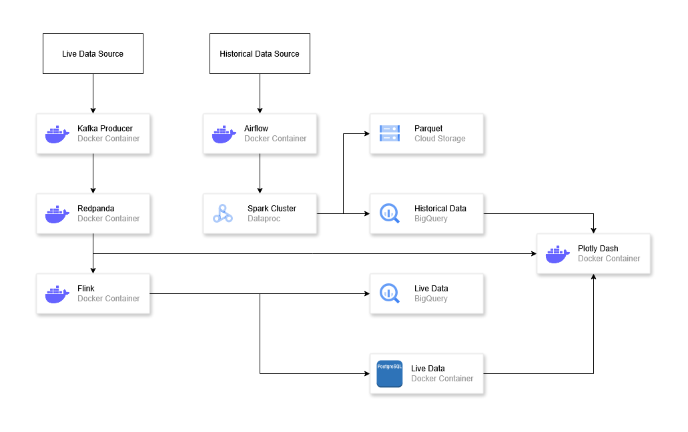
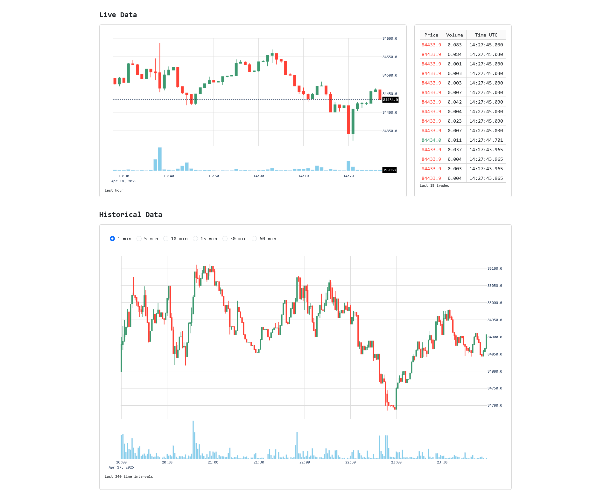

# **Bitcoin Pipeline**


## Objective
This project creates a data pipeline for processing Bitcoin market data with a focus on tick data analysis. Tick data has valuable market information, showing every trade with precise timestamp, price, and volume. The pipeline enables the development and deployment of trading strategies in a real-time streaming environment.

As a proof of concept, the pipeline aggregates tick data into 1-minute OHLCV (Open, High, Low, Close, Volume) candles, while still retaining access to the raw tick data for more in-depth analysis.

Bybit BTCUSDT perpetual futures contract is used in this project and data is accessed through HTTP download and Websocket connection.

## Technology Stack



#### Infrastructure Deployment
- **Terraform:** Infrastructure as code for provisioning cloud resources (BigQuery datasets, tables, GCS buckets)
- **Docker:** Containerization for consistent local deployment

#### Data Ingestion
- **Airflow:** Workflow orchestration for historical tick data processing
- **Kafka:** Producer connecting to Redpanda, consumers for Plotly Dash and Flink

#### Data Storage
- **Google Cloud Storage:** Data lake for historical tick data in Parquet format
- **Bigquery:** Data warehouse for batch and streaming transformations
- **PostgreSQL:** Local database for low-latency access to streaming data
- **DuckDB:** Query cache to manage load from BigQuery and PostgreSQL

#### Batch processing 
- **Spark:** Dataproc cluster for transforming and loading historical tick data

#### Stream processing 
- **Redpanda:** Kafka-compatible messaging system
- **Flink:** Stream processing for transforming tick data into OHLCV format

#### Dashboard
- **Plotly Dash:** Visualization interface for both historical and real-time data

#### Implementation Notes
- Local PostgreSQL database was used for the real-time visualization in Dashboard
- Bigquery was too slow to access at 200 millisecond intervals and Flink inserts into Bigquery took 2-3 minutes
- Live data is still available in Bigquery btcusdt_live table
- There can be gaps in live data and may not be complete. This could be solved using Bybit Rest API
- Historical data is updated daily starting at 00:00 UTC

## Local Deployment

#### Deploy
```
make build      # Build Docker containers
make create     # Create necessary Docker networks and volumes
make backend    # Start backend services

# Trigger Airflow DAG: bybit_pipeline
# (Configure start date in airflow/dags/bybit_pipeline.py)

make run        # Run dashboard associated with dashboard (Dashboard available at http://localhost:8050/)
```

#### Cleanup Local Environment
```
make down       # Stop services
make remove     # Delete Docker networks and volumes. Warning: Deletes all Parquet and PostgreSQL data
```

## GCP Deployment

Configure environment:
- Setup service accounts on GCP
- Rename template.env to .env and configure variables
- template.env files are in root folder and docker/airflow, docker/dash-app, docker/flink, docker/websocket-producer
- Rename terraform_variables to variables.tf and configure

#### Deploy
```
terraform apply
make build-gcp      # Build Docker containers
make create-gcp     # Create necessary local Docker networks and volumes
make backend-gcp    # Start backend services

# Trigger Airflow DAG: bybit_pipeline_gcp
# (Configure start date in airflow/dags/bybit_pipeline_gcp.py)

make run-gcp        # Run dashboard associated with dashboard (Dashboard available at http://localhost:8050/)
```

#### Cleanup GCP Environment
```
make down-gcp       # Stop local services
make remove-gcp     # Delete local Docker networks and volumes
terraform destroy   # Warning: Deletes all data in GCS and BigQuery
```

